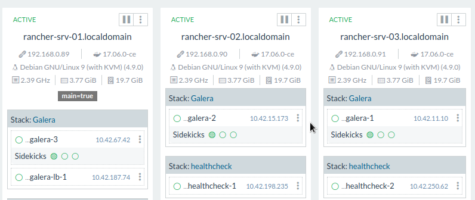

Le monde de l'hébergement change, celui du développement applicatif avec lui. Aujourd'hui on se tourne de moins en moins vers un hébergement dédié pour une seule application, mais plus pour monter l'infrastructure qui la supportera. 

En ce sens, on préfère utiliser une solution Iaas sur du `bare metal` dédié pour notre surcouche applicative que du pur `bare metal` par service.

Les missions de déploiement d'applications poussées par les développeurs doivent s'accorder avec la technologie et la logique de la production. Quels `pipelines` utiliser pour nos `CI`, `CD` ?

Ce post n'aura pas pour but de répondre à la question des pipelines à mettre en place, il sera question de `Rancher`, couplé de son orchestrateur `Cattle`, sur du Public Cloud OVH `Openstack`.

### L'installation :

L'installation des instances `PCI` (Public Cloud) est l'étape la plus rapide. Nous avons besoin pour commencer de 5 instances :


- 1 LoadBalancer/ReverseProxy (`HA-Proxy` ou `Nginx`) à 2€99
- 3 RancherServer en Cluster sous `Galera` à 5€99
- 1 Node Worker (pour nos applications) au prix que vous souhaitez mettre pour vos performances

<br>
#### Le LB Nginx :

Pour l'installation du Nginx, rien de très complexe, une instance à 2€99 suffira largement étant donné que le seul job du serveur sera de forwarder la requête sur notre cluster de rancher.

Le fichier de conf sera donc :


```
upstream rancher {
    server rancher-server1:8080;
    server rancher-server2:8080;
    server rancher-server3:8080;
}

map $http_upgrade $connection_upgrade {
    default Upgrade;
    ''      close;
}

server {
    listen 443 ssl spdy;
    server_name <server>;
    ssl_certificate <cert_file>;
    ssl_certificate_key <key_file>;

    location / {
        proxy_set_header Host $host;
        proxy_set_header X-Forwarded-Proto $scheme;
        proxy_set_header X-Forwarded-Port $server_port;
        proxy_set_header X-Forwarded-For $proxy_add_x_forwarded_for;
        proxy_pass http://rancher;
        proxy_http_version 1.1;
        proxy_set_header Upgrade $http_upgrade;
        proxy_set_header Connection $connection_upgrade;
        proxy_read_timeout 900s;
    }
}

server {
    listen 80;
    server_name <server>;
    return 301 https://$server_name$request_uri;
}
```

Remplacez donc l'`upstream` par les ips de vos serveurs.

Notez qu'il est également possible de dockeriser ce service. De cette manière, le jour où vous mettrez un deuxième LB en frontal, il n'y aura qu'un conteneur à placer sur votre instance.

#### L'installation de Rancher :

Pour la partie Rancher, il n'y a pas non plus de grandes difficultés. Des instances à 5€99 suffiront largement aux besoins.

Je vous conseille la [documentation officielle de Rancher](http://rancher.com/docs/rancher/v1.0/en/installing-rancher/installing-server/multi-nodes/) à ce sujet.

On va commencer par déployer sur chaque serveur Rancher :

```
sudo docker run -d --restart=unless-stopped -p 8080:8080 rancher/server
```

Puis on va ajouter les serveurs les uns aux autres via l'UI. (Infrastructure > Hosts > Add Host)

Vous devriez obtenir le code suivant à exécuter sur chaque noeud :

```
sudo docker run -e CATTLE_AGENT_IP="1.2.3.4"  -e CATTLE_HOST_LABELS='galera=true'  --rm --privileged -v /var/run/docker.sock:/var/run/docker.sock -v /var/lib/rancher:/var/lib/rancher rancher/agent:v1.2.5 http://1.2.3.4:8080/v1/scripts/4956918455D4D9BE3AF1:1483142400000:Fscj9CvRSrx0mS05E4kdWDkb0E
```

Une fois cette étape effectuée, il sera alors possible d'utiliser l'image `Galera` proposée par Rancher (dans le catalogue) sur nos 3 serveurs.
Un noeud sera alors présent sur chaque serveur.

Nous allons pouvoir initialiser le cluster sur un noeud Galera :

```
> CREATE DATABASE IF NOT EXISTS cattle COLLATE = 'utf8_general_ci' CHARACTER SET = 'utf8';
> GRANT ALL ON cattle.* TO 'cattle'@'%' IDENTIFIED BY 'cattle';
> GRANT ALL ON cattle.* TO 'cattle'@'localhost' IDENTIFIED BY 'cattle';
```

Vérifiez ensuite sur les deux autres serveurs que les écritures en base sont également présentes.

Stoppons ensuite un serveur Rancher et faisons le démarrer en utilisant maintenant Galera pour la persistance de ses données :

```
sudo docker run -d --restart=unless-stopped -p 8080:8080 rancher/server \
    --db-host myhost.example.com --db-port 3306 --db-user username --db-pass password --db-name cattle
```

Là ou :

```
--db-host               IP du serveur MySQL
--db-port               port du serveur MySQL (default: 3306)
--db-user               username MySQL login (default: cattle)
--db-pass               password MySQL login (default: cattle)
--db-name               nom de la base MySQL (default: cattle)
```

Faîtes l'opération pour les deux autres serveurs pour que chaque Rancher se lance en utilisant la base de données Galera.

Résultat attendu :



Il est possible de vérifier si Rancher est bien `clusterisé` via l'UI dans : Admin > High Availability.

#### L'ajout de Nodes Worker.

Vous avez à présent votre cluster `Rancher` avec un LB frontal, il est maintenant possible d'ajouter des noeuds `Worker` à votre cluster.
Rien de plus simple que d'en ajouter directement avec l'utilitaire que propose Rancher. Maintenant, à vous de voir quel type d'instance répond au mieux à vos besoins en ressources.

L'environnement par défaut que propose Rancher utilise l'orchestrateur `Cattle`, une fois vos noeuds Workers configurés, il vous sera donc possible de déployer vos conteneurs `Docker` directement depuis votre cluster.


### Conclusion

L'installation d'un environnement Rancher est rapide, le Public Cloud OVH permet de déployer rapidement les instances nécessaires à Rancher.
La simplicité d'utilisation que propose le duo Rancher/Cattle permet une mise en service efficace et fluide.

Nous verrons dans un prochain article comment mettre en place un environnement HA avec `Kubernetes`, toujours sous le PCI OVH et en utilisant le template d'environnement proposé par Rancher.
